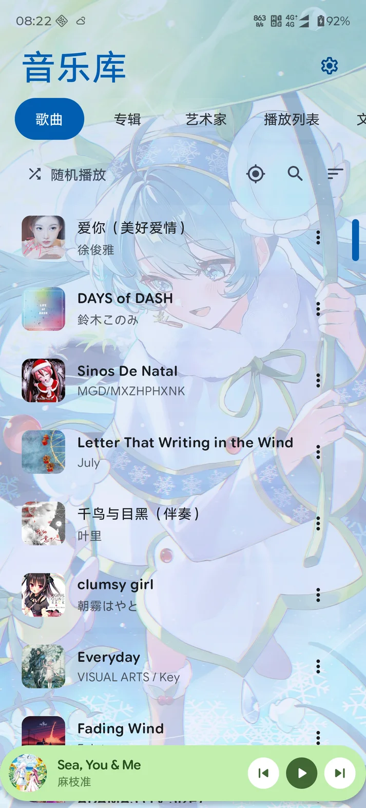
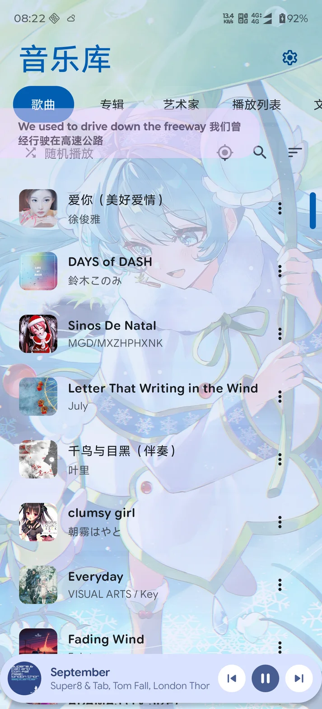

# PPlayer

PPlayer is a local music player for Android.

## Screenshots

<p align="center">
  
  
</p>

Custom wallpapers remain visible through the app's translucent interface, including the player and lyrics views.

## Kept

- Local MediaStore music scanning
- Songs, artists, albums, and search
- Local playback with a foreground notification
- Bottom mini player controls
- Setting: parallel play with other apps
- About page with version only

## Removed

- AI integration and AI playlist generation
- Telegram account/linking/playback
- Cloud music providers and online accounts
- Beta labels, changelog entry, and update prompts
- Developer and diagnostics screens
- Wear OS, Cast, widgets, and baseline profile modules
- Networking SDKs and cloud SDK dependencies

## Build

Build the release APK locally from the `app` module:

```powershell
.\gradlew.bat :app:assembleRelease "-Ppixelplay.enableAbiSplits=true"
```

The arm64-v8a APK is generated under:
`app/build/outputs/apk/release/app-arm64-v8a-release.apk`

Version: `1.0.0`
